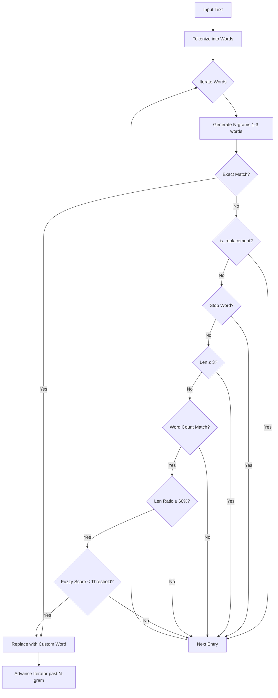

# Custom Word Correction

Custom word correction automatically corrects or replaces transcribed words with user-defined alternatives. It is designed to handle proper nouns, brand names, domain-specific terminology, and common misspellings.

## Dictionary Entry Types

Each dictionary entry has three fields:

| Field | Description |
|-------|-------------|
| `input` | The word/phrase to recognize |
| `replacement` | What to replace it with |
| `is_replacement` | `true` = exact match only, `false` = fuzzy matching enabled |

### Two Modes

| Mode | `is_replacement` | Toggle State | Matching | Use Case |
|------|------------------|--------------|----------|----------|
| **Vocabulary** | `false` (default) | OFF | Fuzzy + Phonetic | Learn words: `modal` matches `model` |
| **Replacement** | `true` | ON | Case-insensitive exact | Expand text: `btw` → `by the way` |

> [!NOTE]
> **Fuzzy matching is the default.** Toggle ON "Replace with different text" for exact replacements like abbreviation expansion.

### Case Adaptation for Replacements

Replacements automatically adapt to the input's case pattern:

| Input | Output | Case Pattern |
|-------|--------|--------------|
| `btw` | `by the way` | lowercase |
| `Btw` | `By the way` | Title Case |
| `BTW` | `BY THE WAY` | ALL CAPS |

## "Best of Both Worlds" Algorithm

We use a hybrid approach that combines **N-gram analysis** with **Advanced Phonetic/Fuzzy Matching**. This allows us to correct both single words and split multi-word phrases even when they are phonetically matched rather than exactly matched.

### Matching Process

1. **Normalization**: Input text and custom words are normalized (lowercase, punctuation stripped).
2. **N-gram Sliding Window**: We scan the input text using a sliding window of 1 to 3 words. This allows us to catch phrases like "Chat G P T" and map them to "ChatGPT".
3. **Hybrid Matching**: For each n-gram, we attempt to match it against your Dictionary entries using prioritized techniques:
   - **Exact Match**: Highest priority. Always checked. (e.g., "handy" → "Handy")
   - **Phonetic Match**: Uses **Double Metaphone** to catch "sounds-like" errors. (e.g., "chat jepity" → "ChatGPT")
   - **Fuzzy Match**: Uses string similarity algorithms:
     - **Jaro-Winkler**: For short words (≤6 chars) to prioritize prefix matching.
     - **Damerau-Levenshtein**: For longer words to handle transpositions and typos.

### Multi-Word Fuzzy Support

Fuzzy matching works for multi-word phrases when the n-gram word count matches the entry word count:

| Transcription | Entry | Match |
|--------------|-------|-------|
| `"super wisper"` | `super whisper → SuperWhisper` | ✅ Fuzzy (2 words = 2 words) |
| `"use chat gpt"` | `ChatGPT` | ❌ Blocked (3 words ≠ 1 word) |

### Logic Flow



### Why this Hybrid Approach?

- **N-grams** alone handled "Chat G P T" well but failed on "Anthrapik" if not exact.
- **Phonetic/Fuzzy** alone handled "Anthrapik" well but failed on split phrases like "Chat G P T".
- **Hybrid** handles **BOTH**: It can take "Chat G P T", combine it into a candidate string, and then phonetically match that candidate against "ChatGPT".

## Configuration

| Setting | Default | Description |
|---------|---------|-------------|
| `dictionary` | `[]` | List of `CustomWordEntry` objects |
| `word_correction_threshold` | `0.18` | Lower = stricter fuzzy matching (0.0–1.0) |

## Examples

| Transcription | Entry (input → replacement) | is_replacement | Match Type | Result |
|--------------|------------------------------|----------------|------------|--------|
| `"modal"` | `modal → modal` | `false` | Fuzzy | `"modal"` (matches "model") |
| `"handy"` | `Handy → Handy` | `false` | Exact | `"Handy"` |
| `"chat G P T"` | `ChatGPT → ChatGPT` | `false` | N-gram + Exact | `"ChatGPT"` |
| `"chat jepity"` | `ChatGPT → ChatGPT` | `false` | N-gram + Phonetic | `"ChatGPT"` |
| `"Anthrapik"` | `Anthropic → Anthropic` | `false` | Fuzzy (Levenshtein) | `"Anthropic"` |
| `"super wisper"` | `super whisper → SuperWhisper` | `false` | Multi-word Fuzzy | `"SuperWhisper"` |
| `"btw"` | `btw → by the way` | `true` | Exact only | `"by the way"` |

## Debug Logging

Enable DEBUG log level to see matching decisions:

```bash
grep -E "\[CustomWords\]" $(ls -t ~/Library/Logs/com.pais.codictate/codictate*.log | head -n 1)
```

Key log messages:
- `Checking n-gram: 'word' (n=1)` — What's being checked
- `Skipping fuzzy: is_replacement=true` — Entry requires exact match
- `Skipping fuzzy: word count 2 != 1` — Word count mismatch
- `Score for 'x' vs 'y': base=0.123, phonetic=true` — Similarity scores
- `Matched 2 word(s): 'super wisper' -> 'SuperWhisper'` — Successful match

## Technical Details

- **Location**: `src-tauri/src/audio_toolkit/text.rs`
- **Data Type**: `CustomWordEntry` in `src-tauri/src/settings.rs`
- **Phonetic Algorithm**: Double Metaphone (via `rphonetic`)
- **String Similarity**: Jaro-Winkler & Damerau-Levenshtein (via `strsim`)
- **Key Config**: `SHORT_WORD_THRESHOLD = 6` (switch point for similarity algos)

## Known Limitations

| Limitation | Impact |
|------------|--------|
| **N-gram size** | Max 3 words per phrase. Longer phrases need exact match. |
| **Performance** | O(N*M) where M is window size (3). Negligible for typical transcriptions. |
| **False positives** | Mitigated by stop word filter, min-length (≤3 chars), and length ratio (≥60%) guards. |

## UI Features

| Feature | Description |
|---------|-------------|
| **Duplicate detection** | Case-insensitive check prevents adding entries with the same input |
| **Character limits** | Input: 100 chars, Replacement: 300 chars |
| **Auto-grow textarea** | Input fields expand up to 3 lines as you type |
