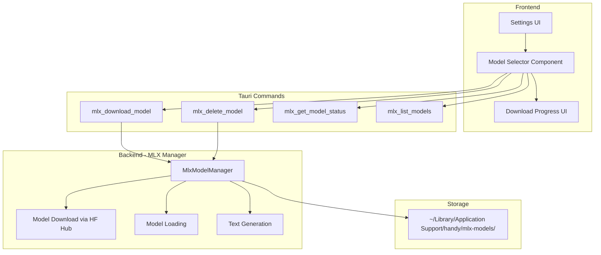
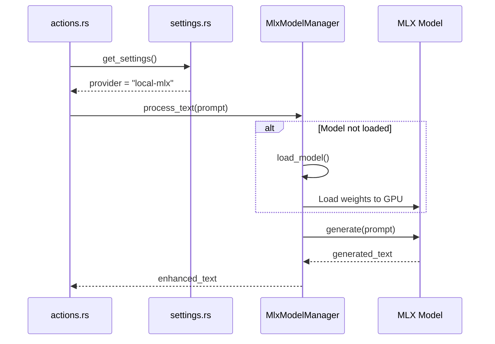
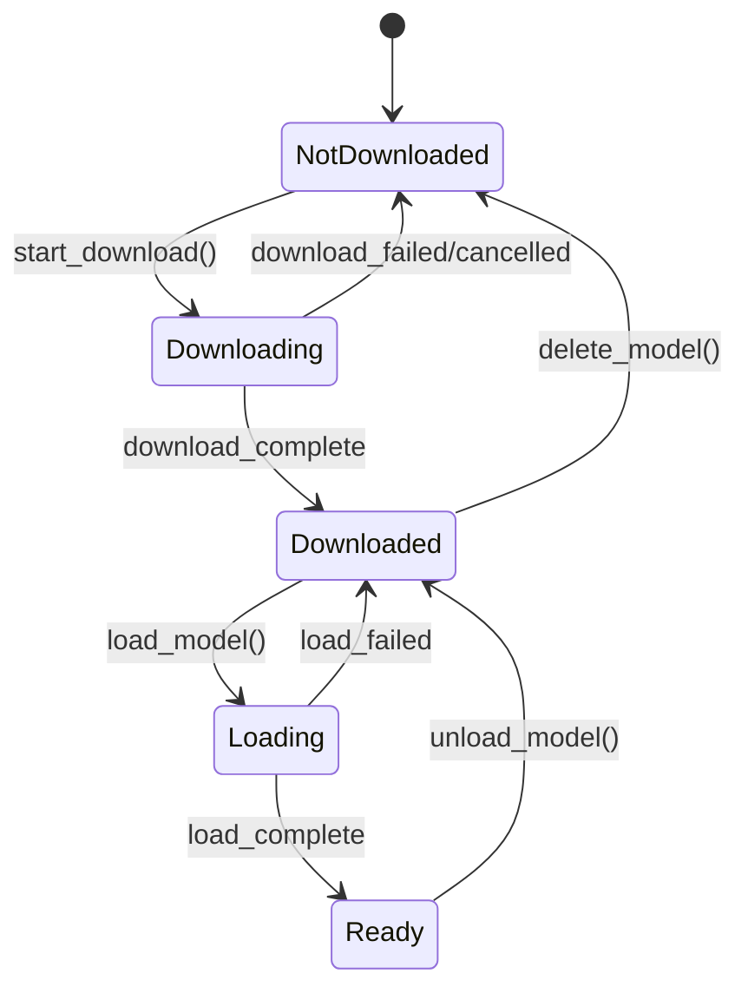

# Design: MLX Local AI Provider

## Context

The macOS WritingTools app provides a proven reference implementation for running local AI models using Apple's MLX framework. This design adapts that pattern to Handy's Rust/Tauri architecture for enhancing transcriptions with on-device LLM inference.

### Reference Implementation Analysis
The WritingTools `LocalModelProvider.swift` demonstrates:
- Model download from Hugging Face Hub with progress tracking
- Model caching in Application Support directory
- Lazy loading with state machine (idle → downloading → downloaded → loading → loaded)
- LLM and VLM support with unified `processText()` API
- Token streaming for responsive UI

### Research Validation

| Finding | Source |
|---------|--------|
| mlx-rs is feature-complete (v0.21.0) | [mlx-rs GitHub](https://github.com/oxideai/mlx-rs) |
| MLX ~1.14x faster than llama.cpp on M3 | Reddit benchmarks Dec 2024 |
| Has working Mistral text generation example | mlx-rs/examples/mistral |
| Industry recommends direct Rust bindings for Tauri | Tauri LLM best practices |
| MLX optimized for Apple Silicon unified memory | Apple MLX documentation |

## Goals / Non-Goals

### Goals
- Provide local LLM inference for post-processing on Apple Silicon Macs
- Match the user experience of the existing cloud-based post-processing
- Enable offline transcription enhancement
- Minimize memory footprint when not in use

### Non-Goals
- Support for non-Apple platforms (Windows/Linux cannot use MLX)
- Custom model training or fine-tuning
- Vision Language Model (VLM) support (future enhancement)
- Streaming token output (initial version will return complete text)

## Architecture



## Key Decisions

### Decision 1: Use mlx-rs for Rust MLX bindings
**Choice:** Use [mlx-rs](https://github.com/oxideai/mlx-rs) v0.21.0 for Rust bindings to Apple's MLX framework.

**Rationale:**
- Native Rust integration with Tauri
- Feature-complete with LLM text generation examples
- Follows MLX versioning for easy tracking
- Avoids FFI complexity of Swift interop

**Alternatives considered:**
- Swift interop via `objc` crate — Too complex, maintenance burden
- Python subprocess with `mlx-lm` — Performance overhead, packaging issues
- llama.cpp — MLX is ~1.14x faster on Apple Silicon

### Decision 2: Separate MLX Model Manager from Transcription Manager
**Choice:** Create a new `MlxModelManager` struct similar to `TranscriptionManager`.

**Rationale:**
- Separation of concerns (transcription vs LLM inference)
- Independent model lifecycle management
- Can unload LLM model while keeping transcription model loaded

### Decision 3: On-Demand Model Loading
**Choice:** Load models on-demand before first inference, not at app startup.

**Rationale:**
- Matches existing transcription model loading pattern
- Reduces startup time
- User controls when to consume GPU memory

### Decision 4: Use Same Unload Timeout as Transcription Engine
**Choice:** Reuse the existing `model_unload_timeout` setting for MLX models.

**Rationale:**
- Consistent user experience
- No new settings to explain
- Existing timeout infrastructure can be reused

### Decision 5: Hugging Face Hub for Model Downloads
**Choice:** Download models from Hugging Face Hub, like the reference WritingTools implementation.

**Rationale:**
- Standard model hosting, widely used
- No self-hosting bandwidth costs
- Same approach as macOS reference implementation

### Decision 6: Model Storage Location
**Choice:** Store models in `~/Library/Application Support/handy/mlx-models/`

**Rationale:**
- Follows macOS conventions
- Separate from transcription models (`resources/models/`)
- User can delete to reclaim space
- Persists across app updates

### Decision 7: Default Model Selection
**Choice:** Use **Qwen 3 Base 1.7B** (1.0 GB) as the default model.

**Rationale:**
- Best balance of speed and quality for most users
- Small enough for quick download (~1GB)
- Good performance on all Apple Silicon Macs
- Qwen 3 family has strong instruction-following capabilities


## Data Flow

### Post-Processing with Local MLX Provider



## Model State Machine



## API Design

### Tauri Commands

```rust
// List available models with their status
#[tauri::command]
fn mlx_list_models() -> Vec<MlxModelInfo>;

// Get status of a specific model
#[tauri::command]
fn mlx_get_model_status(model_id: &str) -> MlxModelStatus;

// Start downloading a model from Hugging Face Hub
#[tauri::command]
async fn mlx_download_model(model_id: &str) -> Result<(), String>;

// Cancel an in-progress download
#[tauri::command]
fn mlx_cancel_download() -> Result<(), String>;

// Retry a failed download (max 3 attempts)
#[tauri::command]
async fn mlx_retry_download() -> Result<(), String>;

// Delete a downloaded model (fails if busy)
#[tauri::command]
fn mlx_delete_model(model_id: &str) -> Result<(), String>;

// Process text with the loaded model
#[tauri::command]
async fn mlx_process_text(prompt: String) -> Result<String, String>;
```

### Events

```typescript
// Model state change notifications
type MlxModelStateEvent = {
  event_type: "download_started" | "download_progress" | "download_completed" | 
              "loading_started" | "loading_completed" | "unloaded" | "error";
  model_id: string;
  progress?: number;  // 0.0 - 1.0 for download_progress
  error?: string;
};
```

## Risks / Trade-offs

### Risk 1: Large model file sizes
- **Impact:** Models are 2-3 GB each, significant download time
- **Mitigation:** Clear progress UI, allow cancellation, warn about disk space

### Risk 2: Memory usage
- **Impact:** Loaded models consume 2-4 GB GPU memory
- **Mitigation:** Auto-unload after timeout (reuse transcription engine setting)

### Risk 3: First inference latency
- **Impact:** Model loading takes 5-15 seconds on first use
- **Mitigation:** Loading indicator in UI, match existing transcription model UX

### Risk 4: mlx-rs API changes
- **Impact:** API may evolve as mlx-rs matures
- **Mitigation:** Pin version 0.21.0, comprehensive error handling

### Risk 5: Concurrent operations
- **Impact:** User may attempt to delete model while downloading or running
- **Mitigation:** Check busy state before delete, reject with clear error message

## Migration Plan

This is a new capability addition, no migration required. Existing users:
- Will see new "Local (MLX)" provider option on Apple Silicon Macs
- Existing cloud provider settings remain unchanged
- No automatic migration to local provider

## Security Considerations

- Model files are downloaded from Hugging Face Hub (HTTPS)
- No API keys stored for local inference
- Model files are user-readable in Application Support
