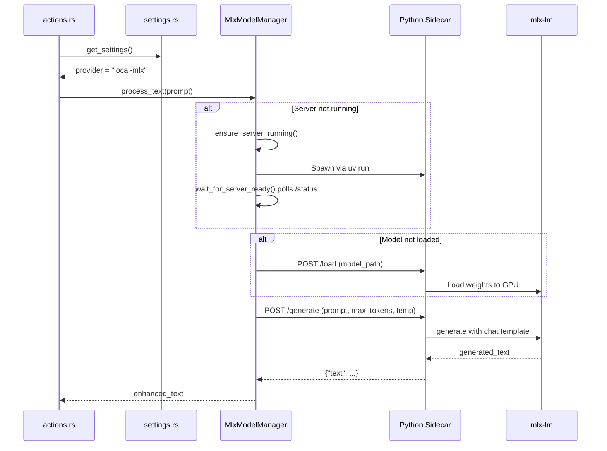

# Design: MLX Local AI Provider

## Context

The macOS WritingTools app provides a proven reference implementation for running local AI models using Apple's MLX framework. This design adapts that pattern to Handy's Rust/Tauri architecture for enhancing transcriptions with on-device LLM inference.

### Reference Implementation Analysis
The WritingTools `LocalModelProvider.swift` demonstrates:
- Model download from Hugging Face Hub with progress tracking
- Model caching in Application Support directory
- Lazy loading with state machine (idle → downloading → downloaded → loading → loaded)
- LLM and VLM support with unified `processText()` API
- Token streaming for responsive UI

### Research Validation

| Finding | Source |
|---------|--------|
| MLX ~1.14x faster than llama.cpp on M3 | Reddit benchmarks Dec 2024 |
| mlx-lm has best model ecosystem support | mlx-lm GitHub examples |
| Python sidecar pattern works well for ML inference | Tauri ML best practices |
| uv provides fast Python environment management | [uv GitHub](https://github.com/astral-sh/uv) |
| MLX optimized for Apple Silicon unified memory | Apple MLX documentation |

## Goals / Non-Goals

### Goals
- Provide local LLM inference for post-processing on Apple Silicon Macs
- Match the user experience of the existing cloud-based post-processing
- Enable offline transcription enhancement
- Minimize memory footprint when not in use

### Non-Goals
- Support for non-Apple platforms (Windows/Linux cannot use MLX)
- Custom model training or fine-tuning
- Vision Language Model (VLM) support (future enhancement)
- Streaming token output (initial version will return complete text)

## Architecture

```mermaid
graph TD
    subgraph Frontend
        A[Settings UI] --> B[Model Selector Component]
        B --> C[Download Progress UI]
    end

    subgraph Tauri Commands
        D[mlx_download_model]
        E[mlx_delete_model]
        F[mlx_get_model_status]
        G[mlx_list_models]
    end

    subgraph Backend - Rust
        H[MlxModelManager]
        H --> I[HTTP Client]
    end

    subgraph Python Sidecar
        J[FastAPI Server :5000]
        J --> K[/load endpoint]
        J --> L[/generate endpoint]
        J --> M[/unload endpoint]
        J --> N[/status endpoint]
        J --> O[mlx-lm library]
    end

    subgraph Runtime
        P[uv binary - bundled]
        P --> Q[python-backend/server.py]
    end

    subgraph Storage
        R[~/.cache/huggingface/hub/]
    end

    B --> D & E & F & G
    D & E --> H
    I --> J
    O --> R
```

## Key Decisions

### Decision 1: Use Python Sidecar with mlx-lm
**Choice:** Use a Python FastAPI sidecar with [mlx-lm](https://github.com/ml-explore/mlx-lm) library, managed by [uv](https://github.com/astral-sh/uv).

**Rationale:**
- Best model ecosystem support (chat templates, tokenizers, quantized models)
- Official Apple MLX library with active development
- Simpler model loading compared to raw Rust bindings
- uv provides fast, reproducible Python environment (~60s first run)

**Alternatives considered:**
- mlx-rs (Rust bindings) — Complex to maintain, limited model format support
- Swift interop via `objc` crate — Too complex, maintenance burden
- llama.cpp — MLX is ~1.14x faster on Apple Silicon

### Decision 2: Separate MLX Model Manager from Transcription Manager
**Choice:** Create a new `MlxModelManager` struct similar to `TranscriptionManager`.

**Rationale:**
- Separation of concerns (transcription vs LLM inference)
- Independent model lifecycle management
- Can unload LLM model while keeping transcription model loaded

### Decision 3: On-Demand Model Loading
**Choice:** Load models on-demand before first inference, not at app startup.

**Rationale:**
- Matches existing transcription model loading pattern
- Reduces startup time
- User controls when to consume GPU memory

### Decision 4: Use Same Unload Timeout as Transcription Engine
**Choice:** Reuse the existing `model_unload_timeout` setting for MLX models.

**Rationale:**
- Consistent user experience
- No new settings to explain
- Existing timeout infrastructure can be reused

### Decision 5: Hugging Face Hub for Model Downloads
**Choice:** Download models from Hugging Face Hub via hf-hub crate (Rust) and mlx-lm (Python).

**Rationale:**
- Standard model hosting, widely used
- No self-hosting bandwidth costs
- Same approach as macOS reference implementation

### Decision 6: Model Storage Location
**Choice:** Store models in `~/.cache/huggingface/hub/` (standard HuggingFace cache)

**Rationale:**
- Follows HuggingFace conventions, shared with other tools
- Separate from transcription models (`resources/models/`)
- User can delete to reclaim space
- Persists across app updates

### Decision 7: Default Model Selection
**Choice:** Use **Qwen 3 Base 1.7B** (1.0 GB) as the default model.

**Rationale:**
- Best balance of speed and quality for most users
- Small enough for quick download (~1GB)
- Good performance on all Apple Silicon Macs
- Qwen 3 family has strong instruction-following capabilities


## Data Flow

### Post-Processing with Local MLX Provider



## Model State Machine


## API Design

### Tauri Commands (Rust)

```rust
// List available models with their status
#[tauri::command]
fn mlx_list_models() -> Vec<MlxModelInfo>;

// Get status of a specific model
#[tauri::command]
fn mlx_get_model_status(model_id: &str) -> MlxModelStatus;

// Start downloading a model from Hugging Face Hub
#[tauri::command]
async fn mlx_download_model(model_id: &str) -> Result<(), String>;

// Cancel an in-progress download
#[tauri::command]
fn mlx_cancel_download() -> Result<(), String>;

// Retry a failed download (max 3 attempts)
#[tauri::command]
async fn mlx_retry_download() -> Result<(), String>;

// Delete a downloaded model (fails if busy)
#[tauri::command]
fn mlx_delete_model(model_id: &str) -> Result<(), String>;

// Process text with the loaded model (via sidecar)
#[tauri::command]
async fn mlx_process_text(prompt: String) -> Result<String, String>;
```

### Python Sidecar Endpoints (FastAPI)

```python
# POST /load - Load a model into memory
# Body: {"model_path": "/path/to/model"}
# Response: {"status": "loaded", "model_path": "..."}

# POST /generate - Generate text
# Body: {"prompt": "...", "max_tokens": 150, "temperature": 0.7}
# Applies: chat template (enable_thinking=False), top_p=0.8, repetition_penalty=1.15
# Response: {"response": "...", "tokens_generated": int}

# POST /unload - Unload model from memory
# Response: {"status": "unloaded", "model_loaded": false}

# GET /status - Health check
# Response: {"status": "running", "model_loaded": bool, "model_path": str|null}
```

### Events

```typescript
// Model state change notifications
type MlxModelStateEvent = {
  event_type: "download_started" | "download_progress" | "download_completed" | 
              "loading_started" | "loading_completed" | "unloaded" | "error";
  model_id: string;
  progress?: number;  // 0.0 - 1.0 for download_progress
  error?: string;
};
```

## Risks / Trade-offs

### Risk 1: Large model file sizes
- **Impact:** Models are 2-3 GB each, significant download time
- **Mitigation:** Clear progress UI, allow cancellation, warn about disk space

### Risk 2: Memory usage
- **Impact:** Loaded models consume 2-4 GB GPU memory
- **Mitigation:** Auto-unload after timeout (reuse transcription engine setting)

### Risk 3: First inference latency
- **Impact:** Model loading takes 5-15 seconds on first use
- **Mitigation:** Loading indicator in UI, match existing transcription model UX

### Risk 4: Python sidecar startup time
- **Impact:** First inference takes ~5-10s for server startup + model loading
- **Mitigation:** Show loading indicator, pre-warm server on settings page visit

### Risk 5: uv binary size
- **Impact:** Bundled uv adds ~42MB to app size
- **Mitigation:** Accept trade-off for reliable Python environment management

### Risk 5: Concurrent operations
- **Impact:** User may attempt to delete model while downloading or running
- **Mitigation:** Check busy state before delete, reject with clear error message

## Migration Plan

This is a new capability addition, no migration required. Existing users:
- Will see new "Local (MLX)" provider option on Apple Silicon Macs
- Existing cloud provider settings remain unchanged
- No automatic migration to local provider

## Security Considerations

- Model files are downloaded from Hugging Face Hub (HTTPS)
- No API keys stored for local inference
- Model files are user-readable in Application Support
